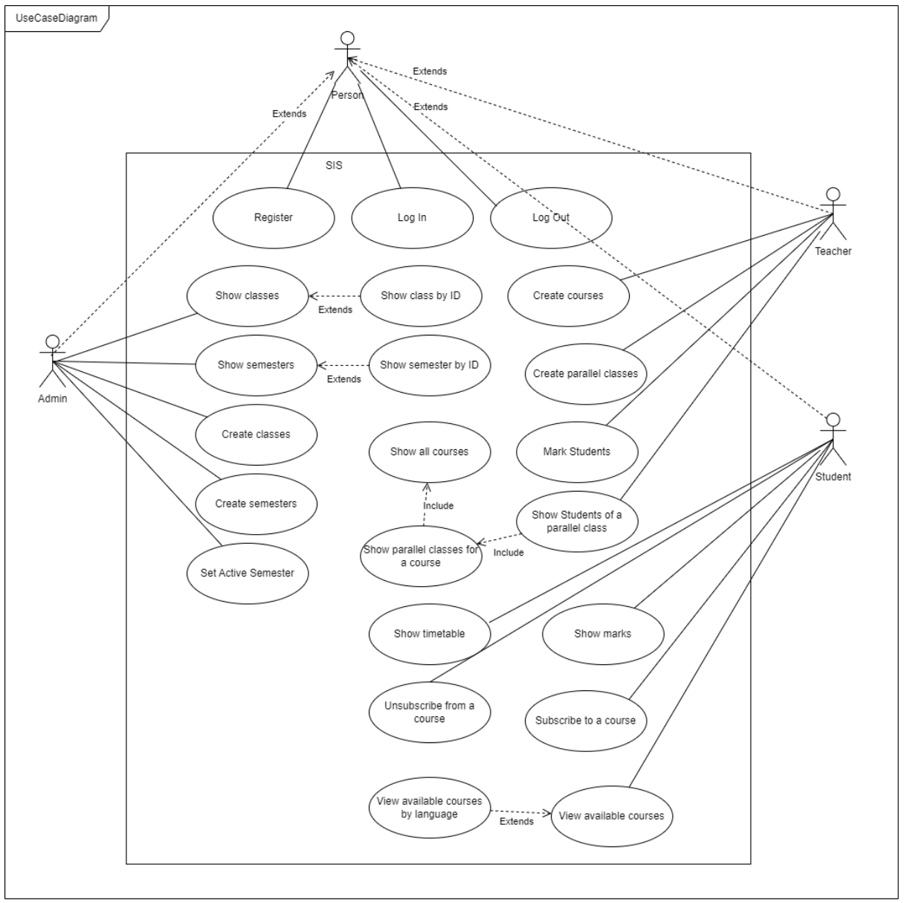
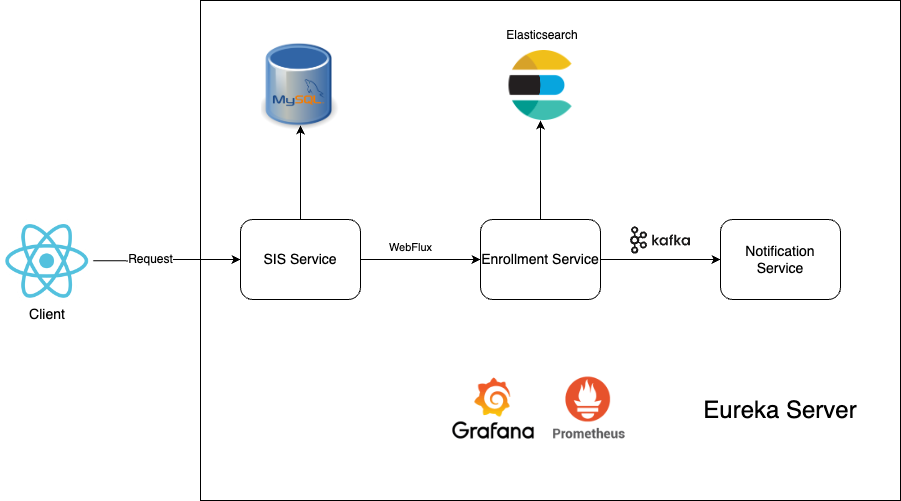

# Student Information System

This project is a Student Information System (SIS) developed in Java and React using a microservices architecture with Docker. It is composed of several microservices that handle specific functionalities within the application.

## Project Overview

Purpose of this application is to provide effective tool for managing teachers, courses and students. Admins manage all the semesters and classrooms, whereas teachers can create courses and all the parallels for each course. Each student can enroll in these parallels and based on student performance, teacher of enrolled course can assign grade.

## Use Case Diagram
<div align="center">
    
</div>

## Technologies Used

### Backend

- Java 17
- Spring Boot 3.2.4
- Spring Cloud
- Spring Data JPA
- Spring Security
- PostgreSQL
- ElasticSearch
- Apache Kafka
- Docker

### Frontend

- JavaScript
- React

## Microservice Architecture
Each microservice in the project is designed using N-layered architecture. Spring Cloud is used to establish the microservice infrastructure, allowing for scalability and distributed management.



 
### SIS Service
- Central service that handles all the requests related to students, courses and teachers.
- Manages the overall business logic of the system.

### Enrollment Service
- Manages student enrollments in various subjects and parallels.
- Uses ElasticSearch to store and retrieve enrollment data.
- Communicates with SIS Service via WebFlux.

### Notification Service
- Sends notification to students when the teacher grade them.
- Utilizes Apache Kafka for handling asynchronous messages.

### Discovery Server
- Registers all the services and manages their discovery to ensure they can communicate with each other.

### Prometheus & Grafana
- Monitors and visualizes all the service metrics.

## How To Run Project

### Frontend
Make sure you have the following installed on your machine:
- Node.js
- NPM library

Run the following commands to start the frontend application:
```bash
cd frontend
npm install
npm start
```

### Backend
Make sure you have the following installed on your machine:
- Java 17
- Docker

Run Docker Compose
- Navigate to the root project directory where the docker-compose.yml file is located.
- Execute the following command to start all services:
```bash
docker-compose up -d
```

Access the Services:
- Discovery Server: http://localhost:8761
- SIS Service: http://localhost:8080
- Enrollment Service: http://localhost:8081
- Notification Service: http://localhost:8082
- Elasticsearch: http://localhost:9200
- Prometheus: http://localhost:9090
- Grafana: http://localhost:3000

### Database Initialization

Upon starting the application, the database will be automatically initialized with some sample data, including:

- **Teachers**: Several teachers such as Jiří Šebek, Jan Novák, and Pablo Escobar.
- **Semesters**: The system creates the current active semester and the next upcoming semester.
- **Classrooms**: A sample classroom (KN:E-127).
- **Courses**: Courses "Návrh Softwarových Systémů," "Programování v Jazyce Java," and "Mezinárodní obchod" are preloaded, each assigned to a respective teacher.
- **Parallels**: Multiple parallels for each course are created with varying capacities and scheduled time slots.

## Project UI


https://github.com/user-attachments/assets/5e294b64-1452-471f-ae16-c91907dae5fc


